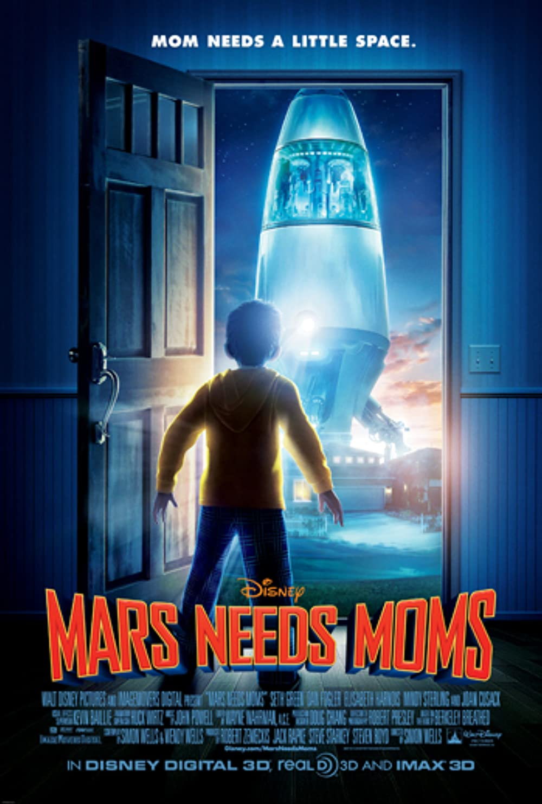

#  Capstone Project - Predicting Movie Box Office Revenue

## Background Information

<table><tr>
<td>  </td>
<td>  </td>
</tr></table>

In the past years, there were many movies that were known to be a theatrical success, such as "Avatar" which was released in 2009 which smashed several box office records at that time. Avatar was reported to have grossed 2.85 billion USD, according to Rotten Tomatoes. [(source)](https://editorial.rottentomatoes.com/article/highest-grossing-movies-all-time/)

While there exist movies that were a hit with the mass audience, there were also movies that flopped terribly. "Mars Needs Mom", an animation film released in 2011 by Walt Disney was one of the worst-performing in film history. Despite costing Disney 150 million USD to produce the film, "Mars Needs Mom" only managed to gross 39.5 million USD worldwide [(source)](https://www.cbsnews.com/pictures/biggest-movie-flops-box-office-bombs/43/), causing Disney to suffer huge losses. Producing a movie typically requires huge amount of resources and time which carries a significant amount of financial and market risk for the production house. Therefore, it is imperative for production companies to make accurate revenue prediction for better resource allocation.

## Problem Statement

The goal of the project is to build a supervised learning model to allow production companies to make better predictions of movie box office revenue instead on relying on intuition and experience, and to identify features that has a strong impact on box office revenue. This will allow them to make better data-driven decisions for resource allocation.

For this project, 2 metrics will be used to evaluate the perfomance of our models:
- Root mean squared error (RMSE)
- $R^{2}$ score

## Executive Summary

The dataset used in this project comes from The Movie Database(TMDB), a popular user-editable database for movies and TV shows. Using the API provided on their website, the movie id for 10,000 movies under the "Popular Movies" section were identified, before scraping data on the primary movie details and data on the casts and crew and subsequently combining them into a single dataset. The initial dataset contained 31 features including revenue, movie budget, genre, cast and crew. Data cleaning, exploratory data analysis and feature engineering were carried out to transform our data to be fit for modelling.

The best performing model was the CatBoost regressor model, which achieved a test $R^{2}$ score of 0.76 and a test RMSE score of 69 million. There were signs of overfitting which were present even after regularization attempts during hyperparameter tuning. Possible reasons include insufficient data in which some rows had to be dropped due to missing revenue data, as well as possible data inaccuracies since TMDB is open-source and thus might not be properly verified. The model also identified vote count and movie budget as the strongest predictors for box office revenue prediction. However, not all the features would be useful to the relevant stakeholders during the planning steps as data on some of these features would only be available post theatrical release. Further improvements could be made to our model, by collecting cross-platform data from IMDB, Rotten Tomatoes or Metacritic, as well as to use NLP techniques and analyze public sentiments on the movie during early stages of production.

## Results

|Model|Train RMSE|Test RMSE|Train R2|Test R2
|---|---|---|---|---|
|Random Forest|31128505.45|71703002.86|0.9560|0.7255
|XGBoost|25933827.92|69204813.05|0.8633|0.7490
|LightGBM|49681234.35|68851181.15|0.8352|0.7444
|CatBoost|48123346.98|69251600.47|0.8840|0.7566

The gradient boosting models performed better as compared to the random forest model and achieved comparable performance. CatBoost was selected as the final model as it had the highest R2 score of 0.7566, with a reasonably lower RMSE score of 69,251,600 as well. However, when comparing the train metrics with the test metrics, we see that there are overfitting issues with our model. This suggest that the model should be further improved before it can be reliably used/deployed.

## Limitations

- There was insufficient data to build a robust model. We scraped movies based on the popularity section on the TMDB website using the TMDB API. However we were only able to scrape the first 500 pages and this limited us to maximum of 10,000 movies.
- Approximately half of the initial dataset had missing values within the target revenue column, which rendered it useless for modellng purposes. This contributed more to insufficient data.
- Possible inaccuracies of data. TMDB is a user-editable database which meant that the data may not be verified before being updated on the website.
- Some predictor variables may not be useful even though they are good predictors for box office revenue, such as vote_count and years_released. These information may not be useful for the stakeholders as some of the data will only be available post-production/post-release.

## Recommendations

- Better feature engineering on some of the original features such as cast and crew information as it is well understood that some audience may be more inclined to watch in theaters if certain cast or crew were involved in the movie
- Combine information from various platforms such as IMDB, Rotten Tomatoes and Metacritic to obtain a more robust dataset
- NLP techniques to analyze public sentiments on the movie during early stages of production.